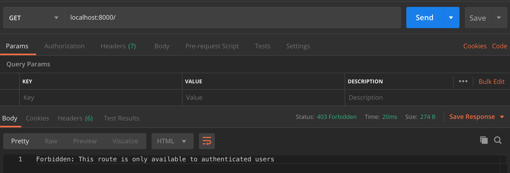
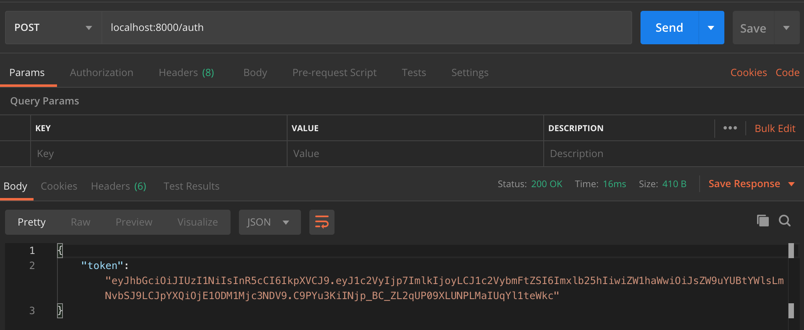
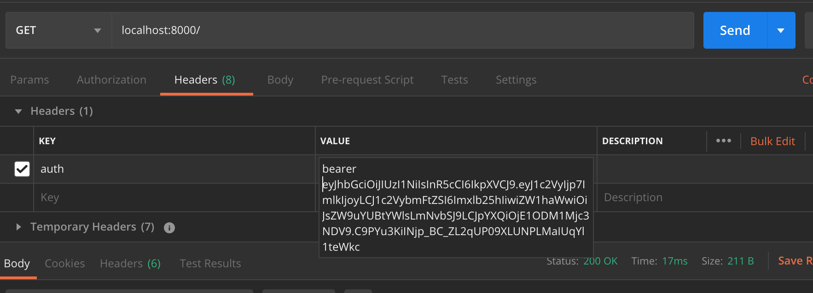

# Meteor Watchlist

> An awesome project with meteors.
> Create meteors to be added to a watchlist

---

# Full Documentation (via Docsify)
https://robotgyal.github.io/meteor-watchlist-node-api/#/

----

# Introduction
## What does your API do?
This API allows users to create their own meteors! This allows for later viewing, editing, and deleting.

---

# Overview
## Things that the developers should know about.
The data at watchlist/all is from the NASA datset

---


# How To Use

1. __Through Postman__ (Preferred Method)
    + First make sure to download [Postman](www.postman.com)
    + Clone this repository locally
    + Run your virtual environment on the folder (not required)
    + Run  `npm install -all` to get all node dependencies
    + Run  `pip3 install -r requirements.txt` to get all python dependencies
    + Run `nodemon server.js` to launch the server. This is required to be able to test the routes through Postman
    + Type in first route `localhost:8000/`
        - This will produce the result 
        - > Forbidden: This route is only available to authenticated users 
        - This is because the routes are locked without proper authentication
        
    + To get access go to the next route `localhost:8000/auth` as a **POST** request
        - This will generate a token that needs to be used to gain access to the other routes (save this token!)
        
        - With the token saved, revisit the route `localhost:8000/`
        - In postman, click the _headers_ tab
        - Enter as the key `auth` and as the value the `bearer GENERATED_TOKEN`. 'bearer' must be in the value, followed by a space, followed by the token
        
    + **This unlocks all routes!** 

2. __Live Link__
    * There is a live live available. It is hosted through [Heroku](www.heroku.com) however as this API only consists of backend rputing, the live link does not have content displayed. 

---

# Error Codes


When attempting to access any route without authentication, expect a **`Status: 403`** error. To resolve, go to the `auth` route to acquire token for use in authentication.

---

# Authentication Routes

## '.../auth/'
```
POST
http://localhost:8000/auth

```

Main watchlist route to show whats in watchlist


---

# Meteor Watchlist Routes
> The following are locked without authentication


## '/'
```
GET
http://localhost:800/

```
show homepage

## '.../watchlist/'
```
GET
http://localhost:8000/watchlist

```

Main watchlist route to show whats in watchlist

## '.../watchlist/:id'
```
GET
http://localhost:8000/watchlist/:id
```

View one meteor on watchlist

## '.../watchlist/delete/:id/'
```
DELETE
http://localhost:8000/watchlist/delete/:id
```

Delete meteor from watchlist

## '.../watchlist/edit/:id'
```
PATCH
http://localhost:8000/watchlist/edit/:id
```

Update meteor from watchlist

## '.../watchlist/add'
```
POST
http://localhost:8000/watchlist/add
```

Add meteor to watchlist

## '.../watchlist/all'
```
GET
http://localhost:8000/watchlist/all
```

View all meteorites in the dataset as json

